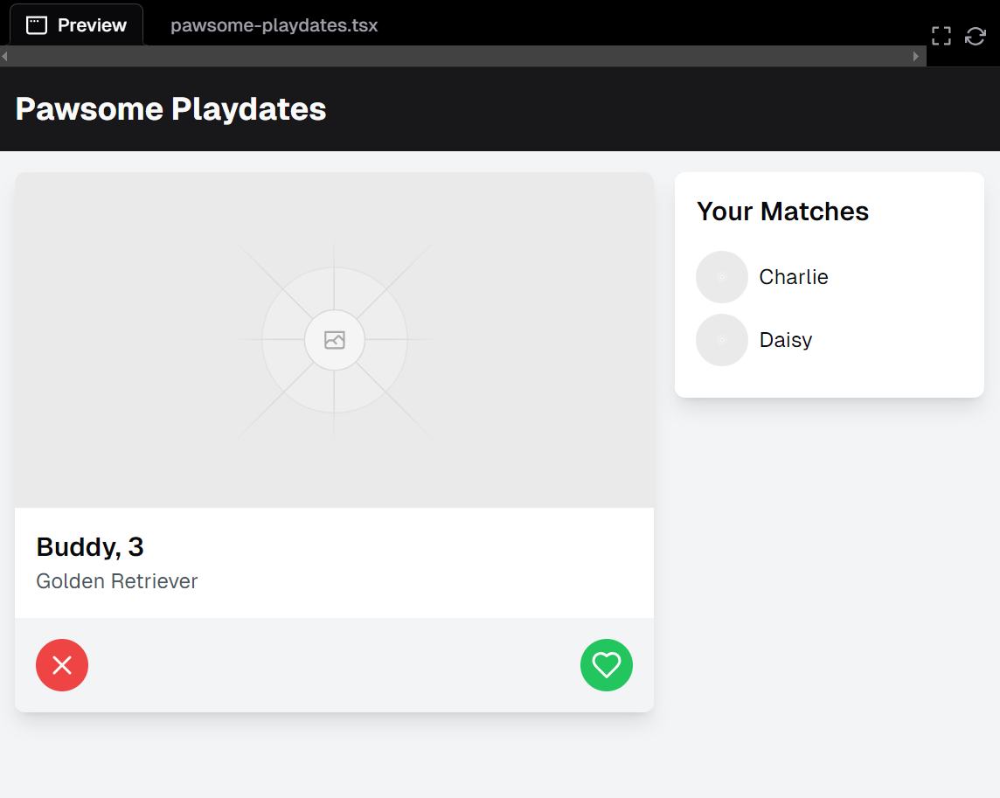

I asked v0 to generate a front end app similar to tinder but for dogs in which they can match with other owner's dogs to setup playdates with their pets. It called it "Pawsome Playdates". I like how simple and realistic the design turned out. I didn't know it would have been that simple to get v0 to generate a front end app. I found it interesting that it was able to capture my vision so well and quickly. I see now how AI like v0 would especially be helpful when it comes to coding. Such as when you are stuck with an error and can't wrap your head around what the problem is sometimes you just need AI to take a peek and it will spot it right away. It truly gives me comfort knowing it is there as a resource throughout my academic career if ever needed. 

Here is a screenshot of what the app would look like:
